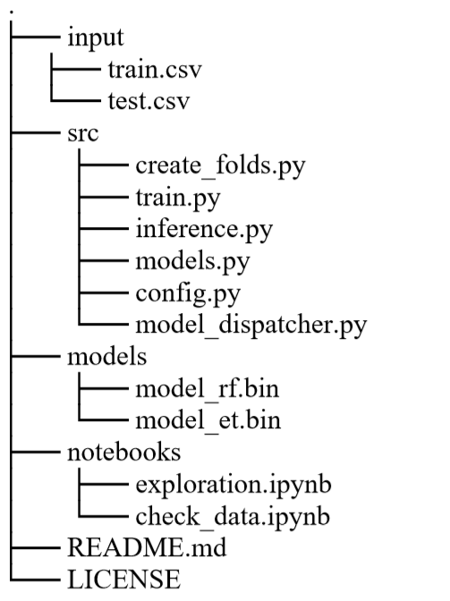

# Description

This is an end-to-end workflow to approach any machine learning problem.
Please note that we will work in an IDE editor rather than jupyter notebooks.

Howerver, we will use Jupyter notebooks for data exploration and visualization.

# Project Structure

The inside of the project folder should look something like the following.



# TRY IT

1- Define the needed parameters in the config file

- data path
- target column
- number of folds

2- Define model to train in the model dispatcher. Always start by a simple model.

3- Train your model from the terminal
```cmd
python train --fold 1 --model xgb
```

4- If you want to process the data, engineer features and manipulate your data, you can add some custom functions inside the 
function `run(fold, model)` in the `train.py` script 
